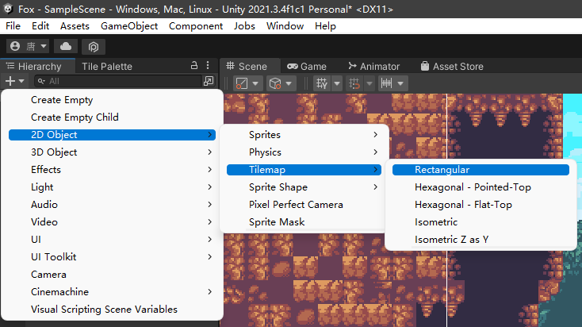
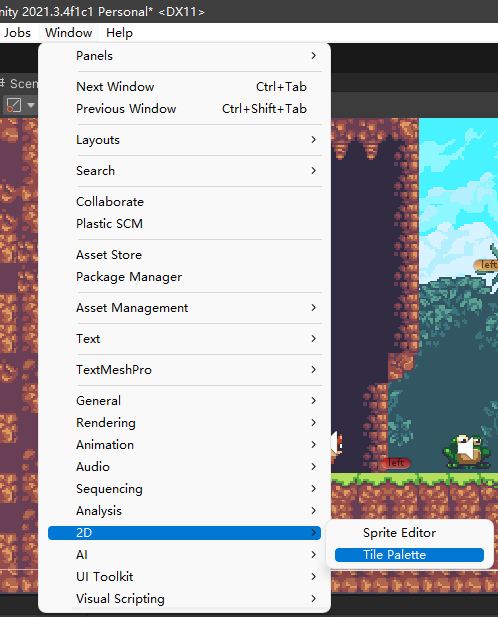
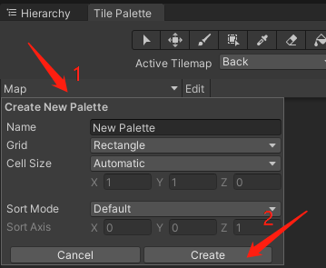
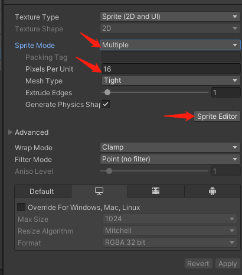
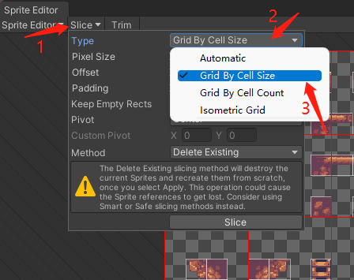
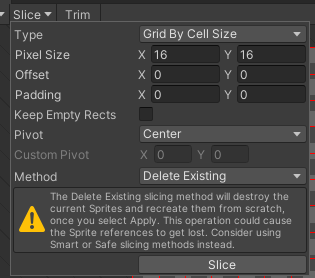
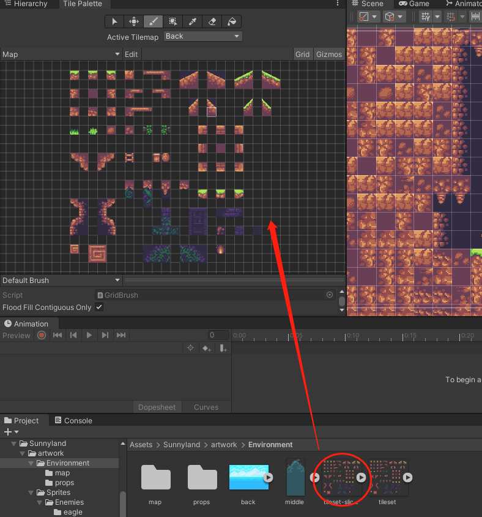

# 简要
- 02节课最重要的是素材的像素分割, 里面有很多小细节, 我决定用图片的形式表现出来, 达到快速浏览记忆的作用.
- 请跟着图片以及图片上的箭头步骤走.

# 方法步骤
- 第一步: 就是创建Tilemap, 我这个版本比较新了, 所以需要多一个步骤, 不过跟着图片走就对了.  

- 第二步: 打开画板窗口.  

- 第三步: 创建一个画板.  

- 第四步: `点击需要切割的图片` 然后按照图片去设置和点击(出现Sprite Editor窗口).  

- 第五步: 对素材进行设置多少像素单位分割.  

- 第六步: 修改 Pixel Size -> 点击 Apple 保存.  

- 第七步: 将修改好的素材拖到 Tile Palette 中使用.  

