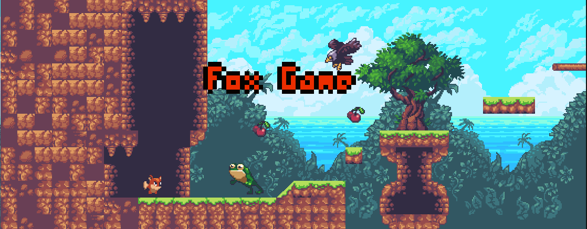

# Brief
- English | [简体中文](./README-CN.md)
- A Unity entry to develop 2D games, for this reason I want to record these entry techniques to better learn and read, and also facilitate subsequent rapid learning and memory.  
- The idea is to write it in the form of a table of contents, and different chapters correspond to different articles, which is conducive to quick search and reading, and saves the time of repeatedly watching videos.
- Everything is for better growth and learning!
# Menu
- [02.编辑素材 (Edit material)](./Menu/02.Edit_material/02.编辑素材_(Edit_material).md)  
- [03.图层layer&角 (Layer layer & corner)]()  
- [04.角色移动 (Character movement)]()  
- [05.角色方向&跳跃 (Character direction & jumping)]()  
- [06.动画效果Anima (Animation effects Anima)]()  
- [07.跳跃动画 Layer (Jump animation Layer)]()  
- [09.镜头控制Cinemachine (Lens Control Cinemachine)]()  
- [10.物品收集 & Prefabs (Item Collection & Prefabs)]()  
- [11.物理材质&空中跳跃 (Physical Material & Air Jump)]()  
- [12.UI入门 (Getting started with UI)]()  
- [13.敌人 (Enemy)]()  
- [14.受伤效果 (Hurt Effect)]()  
- [15.AI敌人移动 (AI enemy moves)]() 
- [16.Animation Events动画事件 (Animation Events animation events)]() 
- [17.类的继承制作更多敌人 (Class inheritance makes more enemies)]() 
- [18.音效 (Audio)]() 
- [19.对话框 (Dialog)]() 
- [20.趴下效果 (Get down effect)]() 
- [21.场景控制 (Scene Control)]() 
- [22.2D光效 (2D light effect)]() 
- [23.优化代码 (Optimize code)]() 
- [24.视觉差 (Parallax)]() 
- [25.主菜单 (Main Menu)]() 
- [26.暂停菜单 (Pause Menu)]() 
- [27.手机控制|触控操作|真机测试 (Mobile phone control | Touch operation | Real machine test)]() 
- [28.二段跳 & 单向平台 (Double Jump & One-Way Platform)]() 
- [29.音效管理 (Sound Manager)]() 
# Notice
It is better to watch the original video about the [installation of the Unity environment](https://www.bilibili.com/video/BV1W4411Z7UC/?spm_id_from=333.788&vd_source=dc445fb4e41d3de7de2083486278c58b) and [the packaging and release of the final game](https://www.bilibili.com/video/BV17E411X7Ss/?spm_id_from=333.788&vd_source=dc445fb4e41d3de7de2083486278c58b).
# Special thanks
Thank you very much for the video tutorial of [Mike](https://space.bilibili.com/370283072), he gave me a lot of help, and then I learned about different languages and interesting technologies of the Unity game engine and the development method different from the Unreal engine, which made me very happy to enter the door of Unity game development !
